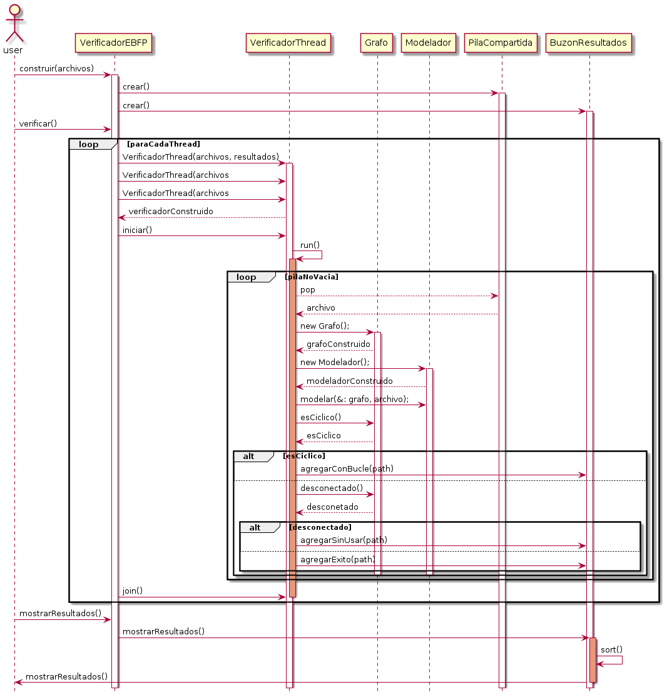

# 7542-Verificador_eBPF

## Nicolás Riedel

## Padrón : 102130

### Repositorio : https://github.com/RiedelNicolas/7542-Verificador_eBPF.

## Trabajo : 

El presente trabajo tiene como objetivo implementar una versión simplificada de un verificador  [eBPF](https://en.wikipedia.org/wiki/Berkeley_Packet_Filter).  Este verificador tiene como objetivo encontrar bucles en el código y/o instrucciones sin ejecutar. 

## Clases desarrolladas :

### Bloquear

Contiene una referencia  a una instancia de  [mutex](http://www.cplusplus.com/reference/mutex/mutex/) se utiliza como bloqueante para proteger los objetos compartidos.

###  BuzonResultados
Objeto compartido entre los [threads](http://www.cplusplus.com/reference/thread/thread/),  se guardan los resultados de los analisis de cada archivo.

### Grafo
Grafo dirigido, se utiliza para moderlar y posteriormente verificar si se encuentran ciclos y/o instrucciones sin ejecutar. 

### Instruccion
Abstraccion de una linea de codigo, se utiliza para guardar los datos parseados.
Puede responder a los booleanos esJump, esRegular, y esRetorno. Esto facilita mucho para formar el grafo.

### Modelador
Modela el codigo recibido en un grafo. Contiene una instancia de parseador que es el encargado de leer el texto, en base a los datos obtenidos modela el grafo.

### Nodo
Nodos del grafo, contienen un ID que representan el numero de linea en el codigo. Conocen a sus nodos adyacentes.

### Parseador
Es el encargado de cargar el archivo de texto a una lista de Instrucciones.

###  PilaProtegida
Una pila protegida, contiene una instancia de [mutex](http://www.cplusplus.com/reference/mutex/mutex/) que protege las  [Race condition
](https://en.wikipedia.org/wiki/Race_condition) . Se utiliza como reservorio de los distintos archivos que toman los threads para analizar. 

### Thread
Implementacion de TDA Thread, fuertemente infulenciado por el del tutorial interactivo. Se utiliza como clase abstracta. 

### VerificadorEBFP
Clase principal del programa, se encarga de que todas interactuen. Es la encargada de instanciar los distintos Threads. 

### VerificadorThread
Clase heredada de Thread. Su flujo consiste en pedir un archivo a la pila compartida, analizarlo y cargar el resultado en el buzon repetido. Repite hasta que la cola este vacia. 

## Diagrama de Clases

##   Diagrama de secuencia, verificar archivos.

## Diagrama de secuencia, como se modela el grafo.

